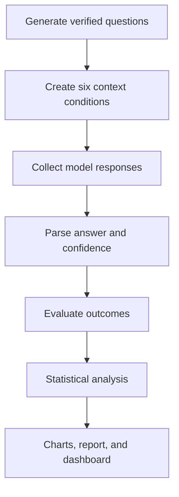

# DataTrust LLM

### Measuring how source-data quality affects LLM hallucination

[](https://www.python.org/)
[](https://streamlit.io/)
[](#testing)
[](LICENSE)

DataTrust LLM is an end-to-end data science project that investigates a practical question in retrieval-augmented generation:

> **How do missing, irrelevant, duplicated, noisy, contradictory, and absent source documents affect the reliability of LLM-generated answers?**

The project creates controlled data-quality problems, collects model responses, evaluates hallucination and related outcomes, applies statistical tests, exports publication-ready charts, and presents the findings in an interactive Streamlit dashboard.

It is designed as a reproducible portfolio project demonstrating experimental design, Python analytics, statistical inference, visualization, responsible AI evaluation, and technical communication.

---

## Table of contents

- [Why this project matters](#why-this-project-matters)
- [Research questions](#research-questions)
- [Project highlights](#project-highlights)
- [Experimental design](#experimental-design)
- [Definitions and metrics](#definitions-and-metrics)
- [Demo results](#demo-results)
- [Dashboard](#dashboard)
- [Project architecture](#project-architecture)
- [Quick start](#quick-start)
- [Run a real LLM experiment](#run-a-real-llm-experiment)
- [Analysis workflow](#analysis-workflow)
- [Testing](#testing)
- [Reproducibility](#reproducibility)
- [Limitations and extensions](#limitations-and-extensions)
- [Portfolio and interview use](#portfolio-and-interview-use)
- [Troubleshooting](#troubleshooting)
- [License](#license)

## Why this project matters

LLM applications are often evaluated as if the model were the only source of failure. In real retrieval-augmented systems, performance is also shaped by the data supplied at inference time. Retrieved documents may be incomplete, duplicated, irrelevant, incorrectly formatted, outdated, or mutually contradictory.

This project treats data quality as an experimental variable. It holds the question and verified answer constant while changing the supporting context. That design makes it possible to measure how each condition affects:

- Factual accuracy
- Grounded hallucination
- Unsupported claims
- Abstention behavior
- Confidence calibration
- Response latency and length

The goal is to identify **which data-quality failures are most strongly associated with unreliable answers** and communicate the uncertainty around those estimates.

## Research questions

1. Does hallucination rate differ across context-quality conditions?
2. Which type of degradation creates the largest reliability risk?
3. Does the model appropriately abstain when evidence is missing?
4. Are incorrect answers delivered with high confidence?
5. How much larger is hallucination risk relative to a clean-context baseline?

### Statistical hypotheses

- **H₀:** Hallucination is independent of context condition.
- **H₁:** Hallucination is associated with context condition.

## Project highlights

- **100 verified factual questions** based on stable periodic-table facts
- **6 controlled context conditions** applied to every question
- **600 question-condition observations** in the included demonstration
- **Deterministic offline provider** for a free, reproducible run
- **Optional OpenAI provider** for a real-model experiment
- **Transparent rule-based evaluator** with auditable labels
- **Bootstrap confidence intervals** for hallucination rates
- **Chi-square test and Cramer's V** for association and effect size
- **Logistic regression odds ratios** relative to clean context
- **Interactive Streamlit dashboard** with filters and response inspection
- **Three exported figures**, an executive report, and automated tests

## Experimental design

The project uses a within-question design. Each question is evaluated under every context condition. The question and gold answer remain unchanged while the supplied evidence is modified.

| Condition | Context treatment | Failure being tested |
|---|---|---|
| `clean` | One correct answer-bearing statement | Baseline reliability |
| `missing` | The answer-bearing value is removed | Incomplete evidence |
| `irrelevant` | Unrelated true statements are added | Resistance to distraction |
| `duplicate_noise` | Evidence is repeated and surrounded by formatting noise | Attention dilution |
| `contradictory` | Correct and incorrect claims appear together | Conflict resolution |
| `no_context` | No evidence is supplied | Parametric memory and abstention |

### Benchmark choice

The benchmark asks for the atomic numbers of the first 100 chemical elements. These facts are stable, unambiguous, easy to verify, compact, and suitable for exact numeric evaluation. This improves measurement reliability, although it limits external validity.

### Prompting policy

The model is instructed to use only the supplied context, abstain when evidence is insufficient, and return a confidence score:

```text
ANSWER: <answer>
CONFIDENCE: <number from 0 to 1>
```

## Definitions and metrics

Hallucination has multiple definitions. This project uses a strict, retrieval-grounded operational definition.

| Metric | Operational definition |
|---|---|
| `answer_correct` | Parsed answer matches the verified gold answer |
| `abstained` | Response contains a recognized uncertainty phrase |
| `context_supports_gold` | Context explicitly contains the verified claim |
| `unsupported_claim` | Definite answer is given without gold-supporting evidence |
| `hallucinated` | A definite answer is incorrect **or** unsupported |
| `appropriate_abstention` | Model abstains when supporting evidence is unavailable |
| `confidence_error` | Absolute difference between confidence and binary correctness |

Under this definition, a factually correct answer can still be unsupported. This reflects a RAG setting in which the application is expected to ground its answer in retrieved evidence.

For a fact-only definition:

```python
fact_only_hallucination = (~results["answer_correct"]) & (~results["abstained"])
```

## Demo results

The repository includes a complete 600-row run produced by the deterministic mock provider. These results validate the analytical workflow; they are **not measurements of an OpenAI model or another production LLM**.

| Condition | Accuracy | Hallucination | Abstention | Unsupported claims |
|---|---:|---:|---:|---:|
| Clean | 97% | 3% | 0% | 0% |
| Irrelevant | 89% | 11% | 0% | 0% |
| Duplicate/noise | 89% | 11% | 0% | 0% |
| Contradictory | 52% | 48% | 0% | 0% |
| Missing | 27% | 36% | 64% | 36% |
| No context | 53% | 72% | 28% | 72% |

### Statistical summary

- Clean-context hallucination: **3%**
- Highest hallucination: **72%** under `no_context`
- Chi-square: **169.69**
- p-value: **8.48 × 10⁻³⁵**
- Cramer's V: **0.532**

In the simulated run, context condition has a strong association with hallucination. The contrast between `missing` and `no_context` also shows why accuracy should not be interpreted alone: abstention can be desirable when evidence is unavailable.


Generated outputs include:

- [`outputs/executive_report.md`](outputs/executive_report.md) — findings and recommendations
- [`outputs/analysis_summary.csv`](outputs/analysis_summary.csv) — metrics and confidence intervals
- [`outputs/statistical_tests.json`](outputs/statistical_tests.json) — test results and odds ratios
- [`outputs/figures/confidence_vs_correctness.png`](outputs/figures/confidence_vs_correctness.png)
- [`outputs/figures/outcome_heatmap.png`](outputs/figures/outcome_heatmap.png)

## Dashboard

The Streamlit dashboard provides headline metrics, condition filters, hallucination rates with 95% bootstrap intervals, grouped outcome comparisons, confidence-versus-correctness analysis, question-level response inspection, and statistical-test details.

```bash
streamlit run app.py
```

Open the local URL printed in the terminal, normally `http://localhost:8501`.

## Project architecture

```text
llm-hallucination-data-quality/
├── app.py                         # Streamlit dashboard
├── config.yaml                    # Experiment settings
├── Makefile                       # Workflow commands
├── pyproject.toml                 # Package metadata
├── requirements.txt               # Dependencies
├── data/
│   ├── raw/questions.csv          # Verified benchmark
│   └── processed/results.csv      # Responses and labels
├── docs/
│   ├── DATA_DICTIONARY.md
│   ├── METHODOLOGY.md
│   └── PORTFOLIO_GUIDE.md
├── outputs/
│   ├── figures/
│   ├── analysis_summary.csv
│   ├── executive_report.md
│   └── statistical_tests.json
├── scripts/
│   ├── generate_data.py
│   ├── run_experiment.py
│   ├── evaluate_results.py
│   └── analyze_results.py
├── src/datatrust/
│   ├── analysis.py
│   ├── config.py
│   ├── corruption.py
│   ├── data.py
│   ├── evaluation.py
│   ├── experiment.py
│   └── providers.py
└── tests/
```

### Pipeline



## Quick start

Requirements: Python 3.10+, `pip`, and approximately 500 MB for the environment.

### macOS or Linux

```bash
git clone <your-repository-url>
cd llm-hallucination-data-quality

python3 -m venv .venv
source .venv/bin/activate
python -m pip install --upgrade pip
pip install -r requirements.txt

make all
streamlit run app.py
```

### Windows PowerShell

```powershell
git clone <your-repository-url>
cd llm-hallucination-data-quality

py -m venv .venv
.venv\Scripts\Activate.ps1
python -m pip install --upgrade pip
pip install -r requirements.txt

python scripts/generate_data.py
python scripts/run_experiment.py --overwrite
python scripts/evaluate_results.py
python scripts/analyze_results.py
streamlit run app.py
```

The default configuration uses the offline mock provider. No API key is required.

## Run a real LLM experiment

### 1. Configure the API key

```bash
cp .env.example .env
```

Add the key to `.env`:

```text
OPENAI_API_KEY=your_key_here
```

Never commit `.env` or expose an API key in a notebook, screenshot, or repository.

### 2. Update `config.yaml`

```yaml
experiment:
  provider: openai
  model: gpt-4.1-mini
  sample_size: 10
  temperature: 0.0
  max_tokens: 120
```

Start with 10 questions to validate output and estimate cost. Increase `sample_size` only after inspecting the initial results. Model availability and pricing depend on the API account.

### 3. Run the pipeline

```bash
python scripts/generate_data.py
python scripts/run_experiment.py --overwrite
python scripts/evaluate_results.py
python scripts/analyze_results.py
streamlit run app.py
```

The overwrite flag is intentionally required when results already exist. Back up important runs before replacing them.

## Analysis workflow

| Command | Output |
|---|---|
| `python scripts/generate_data.py` | Creates the 100-question benchmark |
| `python scripts/run_experiment.py --overwrite` | Collects responses for all configured conditions |
| `python scripts/evaluate_results.py` | Adds reliability labels |
| `python scripts/analyze_results.py` | Produces statistics, charts, and report |
| `make all` | Runs the full pipeline |
| `make test` | Runs unit tests |
| `make dashboard` | Starts Streamlit |
| `make clean` | Removes generated data and outputs |

The analysis includes descriptive rates, bootstrap confidence intervals, chi-square testing, Cramer's V, risk ratios, logistic-regression odds ratios, static charts, and an executive Markdown report.

## Configuration

Main settings live in `config.yaml`:

```yaml
project:
  seed: 42
  questions_path: data/raw/questions.csv
  results_path: data/processed/results.csv
  outputs_dir: outputs

experiment:
  provider: mock
  model: deterministic-demo-v1
  sample_size: 100
  temperature: 0.0
  max_tokens: 120
  conditions:
    - clean
    - missing
    - irrelevant
    - duplicate_noise
    - contradictory
    - no_context

evaluation:
  bootstrap_iterations: 2000
  confidence_level: 0.95
```

The abstention phrase list can be expanded in this file for different models.

## Testing

```bash
pytest -q
```

or:

```bash
make test
```

Tests verify context corruption, numeric matching, abstention detection, and the grounded-hallucination definition. Current status: **6 tests passed**.

## Reproducibility

Demo mode is deterministic: context corruption, mock responses, and bootstrap sampling use stable seeds. A repeated demo run should produce the same substantive outcomes.

Real API runs may vary even at temperature zero because providers can update model weights, routing, or infrastructure. Preserve raw responses, model identifiers, prompts, configuration, UTC timestamps, environment details, and evaluation version.

For publication-quality validation:

1. Randomly sample at least 10% of responses.
2. Use two independent annotators for correctness, support, abstention, and hallucination.
3. Calculate Cohen's kappa.
4. Adjudicate disagreements.
5. Report automated and human-reviewed metrics separately.

See [`docs/METHODOLOGY.md`](docs/METHODOLOGY.md) and [`docs/DATA_DICTIONARY.md`](docs/DATA_DICTIONARY.md).

## Limitations and extensions

### Limitations

- Chemistry does not represent every retrieval or reasoning task.
- Numeric exact matching is easier than long-form evaluation.
- One generation per cell does not estimate generation variance.
- Rule-based evaluation can miss semantic nuance.
- Self-reported confidence is not necessarily calibrated.
- Included results are simulated workflow results.
- Evidence detection is tailored to the benchmark.
- Results do not justify universal claims about LLM safety.

### High-value extensions

- Add geography, medicine, finance, history, and technology.
- Include temporal facts to test outdated sources.
- Add multi-hop questions and multiple corruption intensities.
- Compare several models with repeated generations.
- Randomize evidence order in contradictory contexts.
- Add human annotation and inter-annotator agreement.
- Measure citation precision, recall, entailment, cost, and token usage.
- Store versioned experiments in SQLite or DuckDB.
- Add GitHub Actions, Docker, and cloud deployment.

## Portfolio and interview use

### 30-second explanation

> I built a controlled experiment to measure how source-data quality affects LLM reliability. I held 100 questions constant, generated six versions of the supporting context, and evaluated 600 responses for accuracy, hallucination, unsupported claims, abstention, and confidence. I quantified uncertainty with bootstrap intervals, tested association with chi-square and Cramer's V, estimated relative odds with logistic regression, and communicated the findings through a Streamlit dashboard.

### Suggested résumé bullet

> Built a reproducible analytics pipeline evaluating 600 LLM responses across six source-data quality conditions; quantified hallucination risk using bootstrap confidence intervals, chi-square testing, effect size, and logistic regression, and presented findings in an interactive Streamlit dashboard.

### Skills demonstrated

Python, Pandas, NumPy, experimental design, statistical inference, data validation, Matplotlib, Seaborn, Plotly, Streamlit, LLM API integration, responsible AI evaluation, testing, and technical documentation.

See [`docs/PORTFOLIO_GUIDE.md`](docs/PORTFOLIO_GUIDE.md).

## Troubleshooting

### `ModuleNotFoundError`

Activate the environment and reinstall dependencies:

```bash
pip install -r requirements.txt
```

### Results already exist

```bash
python scripts/run_experiment.py --overwrite
```

Back up important results first.

### `OPENAI_API_KEY is not set`

Create `.env` from `.env.example`, add the key, and confirm `provider: openai` is intended. Use `provider: mock` for offline mode.

### Streamlit command not found

```bash
python -m streamlit run app.py
```

### Response parsing fails

Inspect `raw_response` in `data/processed/results.csv`. Update `parse_answer_and_confidence()` in `src/datatrust/providers.py`, or use structured outputs.

### Perfect separation in logistic regression

This can occur if a condition produces only one outcome. Increase the sample size or use penalized logistic regression.

## Responsible use

Do not use this project to declare that a model is universally safe or unsafe. Results depend on the benchmark, prompt, context construction, evaluator, model version, and sampling design. Report null and negative results, distinguish simulation from real-model measurements, and avoid sending sensitive data to external APIs.

## License

Released under the [MIT License](LICENSE).

## Author

**Elham “Ellie” Ghiasi**  
M.S. in Computer Science  
Interests: data science, LLM evaluation, retrieval-augmented generation, knowledge graphs, and responsible AI


